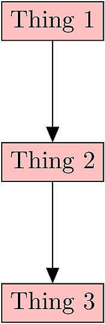

---
title: 'Slides template'
subtitle: 'A starting point for presentations'
author: 'Chris Winstead'
title-bg: 'figures/OldMainTower.png'
fontsize: '10pt'
...


# Making slides

* I like HTML presentations based on [Slidy](https://www.w3.org/Talks/Tools/Slidy2/Overview.html), but many 
prefer PDF slides produced by [\LaTeX/Beamer](https://www.ctan.org/pkg/beamer).  


* It can be a challenge to write code in either HTML or \LaTeX.  

* [Markdown and Pandoc]() provide an easy text-based syntax for writing papers and presentations.  
* This template is designed to work with Pandoc to simultaneously:

   - Produce html output based on slidy
   - Produce matching PDF output based on \LaTeX/Beamer


# Procedure

 1. Prepare slides in a text document using Markdown syntax.
 2. Place any images in the `figures/` subdirectory.
 3. Edit the included `Makefile` to specify the presentation name and other details.
 4. Build the presentation by running `make`


# Including Figures

To include a figure using Markdown, use this syntax:

```
{width=60%}
```

Result:

{width=60%}


# Two-Column Slides

Starting two-column mode:

||*

Here is a column.

* Text.
* More text.
* Description.
* Discussion.

||+

And another column.

{width=20%}

*||

Columns are now over.


# Two-Column Slides

Starting two-column mode:

::::::::::{.columns}

:::{.column width=40%}
Here is a column.

* Text.
* More text.
* Description.
* Discussion.

:::
:::{.column width=40%}

And another column.

{width=20%}

:::
:::::::::::

Columns are now over.


